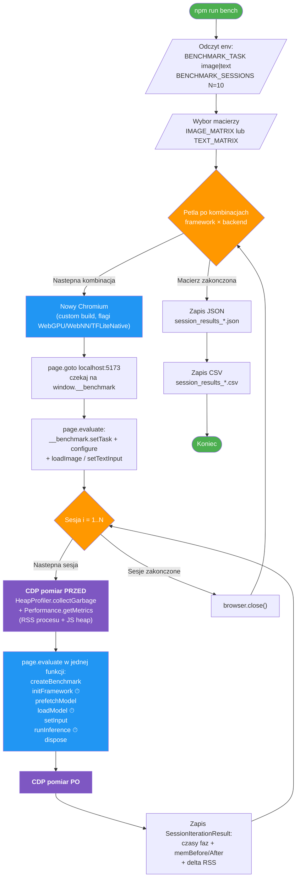

# Przebieg benchmarku

Pomiar wydajnosci jest wykonywany na trzy sposoby. Wszystkie korzystaja z tych
samych adapterow frameworkow (`src/benchmarks/`), ale roznia sie poziomem
automatyzacji i tym, kto zbiera metryki.

| Wejscie | Plik | Co mierzy | Pomiar pamieci / CPU / GPU |
|---|---|---|---|
| Aplikacja webowa (UI) | `src/main.ts` | `performance.now()` w przegladarce | `performance.memory` (heap V8) |
| Test Playwright (TypeScript) | `e2e/benchmark.spec.ts` | `performance.now()` przekazane przez `page.evaluate` | CDP `Performance.getMetrics` (RSS procesu + JS heap) |
| Profiler Python | `e2e/benchmark_profiler.py` | jak wyzej, ale steruje UI klikajac przyciski | `psutil` + `nvidia-smi`, sampling co ~50 ms |

## 1. Tryb interaktywny (UI)

```mermaid
flowchart TD
    Start([Klik 'Run Benchmark']) --> ModeCheck{Wybrany tryb?}

    %% ===== TRYB ZAGREGOWANY =====
    ModeCheck -->|Zagregowany| A_Config[/Odczyt konfiguracji:<br/>framework, backend, zadanie,<br/>liczba iteracji, warmup/]
    A_Config --> A_Create["Utworzenie adaptera<br/>createBenchmark(framework, task)"]
    A_Create --> A_MemBefore["Pomiar pamięci PRZED<br/>performance.memory"]
    A_MemBefore --> A_Init["<b>Faza 1: Inicjalizacja frameworka</b><br/>initFramework(backend)<br/>⏱ mierzony czas"]
    A_Init --> A_Prefetch["Pobranie modelu z sieci<br/>prefetchModel()<br/>⏱ czas NIE mierzony"]
    A_Prefetch --> A_Load["<b>Faza 2: Kompilacja modelu</b><br/>loadModel()<br/>⏱ mierzony czas"]
    A_Load --> A_Input["Przygotowanie i ustawienie danych wejsciowych"]
    A_Input --> A_WarmupCheck{warmup > 0?}
    A_WarmupCheck -->|Tak| A_Warmup["<b>Faza 3: Rozgrzewka</b><br/>N iteracji inferencji<br/>wyniki odrzucone"]
    A_Warmup --> A_Infer
    A_WarmupCheck -->|Nie| A_Infer
    A_Infer["<b>Faza 4: Pomiar inferencji</b><br/>N iteracji, każda mierzona osobno<br/>⏱ zbieranie czasów do tablicy"]
    A_Infer --> A_Classify["<b>Faza 5: Klasyfikacja</b><br/>classify(topK=5)<br/>pobranie predykcji"]
    A_Classify --> A_MemAfter["Pomiar pamieci PO"]
    A_MemAfter --> A_Stats["Obliczenie statystyk:<br/>avg, min, max, p95, delta pamieci,<br/>ocena trafnosci"]
    A_Stats --> A_Display["Wyświetlenie wyników w tabeli"]
    A_Display --> A_Dispose["Zwolnienie zasobow<br/>benchmark.dispose()"]
    A_Dispose --> A_End([Koniec])

    %% ===== TRYB SESYJNY =====
    ModeCheck -->|Sesyjny<br/>per-iteracja| S_Config[/Odczyt konfiguracji:<br/>framework, backend, zadanie,<br/>liczba sesji/]
    S_Config --> S_Input["Przygotowanie danych wejsciowych<br/>(jednokrotne, przed petla)"]
    S_Input --> S_MemInit["Pomiar pamięci PRZED<br/>performance.memory"]
    S_MemInit --> S_Loop{"Sesja i = 1..N"}

    S_Loop -->|Nastepna sesja| S_Create["Nowa instancja adaptera<br/>createBenchmark(framework, task)"]
    S_Create --> S_Init["Inicjalizacja frameworka<br/>initFramework(backend)<br/>⏱ mierzony czas"]
    S_Init --> S_Prefetch["Pobranie modelu<br/>prefetchModel()<br/>⏱ czas NIE mierzony<br/>(po sesji 1 - cache)"]
    S_Prefetch --> S_Load["Kompilacja modelu<br/>loadModel()<br/>⏱ mierzony czas<br/>(po sesji 1 — cache)"]
    S_Load --> S_SetInput["Ustawienie danych wejsciowych"]
    S_SetInput --> S_Infer["Pojedyncza inferencja<br/>runInference()<br/>⏱ mierzony czas"]
    S_Infer --> S_Mem["Pomiar pamieci<br/>+ delta wzgledem poprzedniej sesji"]
    S_Mem --> S_Row["Dodanie wiersza do tabeli sesji"]
    S_Row --> S_Dispose["Zwolnienie zasobow<br/>benchmark.dispose()"]
    S_Dispose --> S_Loop

    S_Loop -->|Wszystkie sesje zakonczone| S_End([Koniec])

    %% ===== STYL =====
    style Start fill:#4CAF50,color:#fff
    style A_End fill:#4CAF50,color:#fff
    style S_End fill:#4CAF50,color:#fff
    style ModeCheck fill:#FF9800,color:#fff
    style A_WarmupCheck fill:#FF9800,color:#fff
    style S_Loop fill:#FF9800,color:#fff
    style A_Init fill:#2196F3,color:#fff
    style A_Load fill:#2196F3,color:#fff
    style A_Warmup fill:#9E9E9E,color:#fff
    style A_Infer fill:#2196F3,color:#fff
    style A_Classify fill:#2196F3,color:#fff
    style S_Init fill:#2196F3,color:#fff
    style S_Load fill:#2196F3,color:#fff
    style S_Infer fill:#2196F3,color:#fff
    style A_Prefetch fill:#78909C,color:#fff
    style S_Prefetch fill:#78909C,color:#fff
```

## 2. Test Playwright (`npm run bench`)

`e2e/benchmark.spec.ts` automatyzuje tryb sesyjny dla calej macierzy `framework × backend`
i dodaje pomiar pamieci procesu poprzez Chrome DevTools Protocol (CDP).

Kluczowe rozni od trybu UI:

- **Jedna nowa instancja Chromium na kazda kombinacje** (`chromium.launch` z dedykowanymi flagami:
  `--enable-precise-memory-info`, `--js-flags=--expose-gc`, `--enable-unsafe-webgpu`,
  `--enable-blink-features=TFLiteNativeInference`, `WebNN*` features). Izolacja pamieci miedzy
  kombinacjami.
- **N sesji w tym samym browserze** (default `BENCHMARK_SESSIONS=10`). W kazdej sesji adapter
  jest tworzony od nowa (`createBenchmark`) i wywolywane sa wszystkie fazy
  (`initFramework` → `prefetchModel` → `loadModel` → `runInference` → `dispose`),
  ALE skompilowany model jest cachowany na poziomie modulu (`let cachedModel/Session/Classifier`
  w `src/benchmarks/*.ts`). Sesja 1 mierzy realny cold-start; sesje 2..N mierza
  koszt cache-hit (≈ 0 ms `loadModel`, kilka ms `initFramework` po cachowaniu WASM
  w przegladarce).
- **CDP `HeapProfiler.collectGarbage` przed kazdym pomiarem** + 300 ms odczekania, zeby zmierzyc
  pamiec po GC.
- **`Performance.getMetrics`** wyciaga `ProcessPrivateMemoryFootprint` (RSS calego procesu rendera)
  i `JSHeapUsedSize`. Zapisywane sa wartosci PRZED i PO kazdej sesji + delta.
- **Brak rozgrzewki** — kazda inferencja sie liczy.
- Wyniki: `benchmark_results/session_results_{image|text}.{json,csv}`.

## 3. Profiler Python (`npm run bench:profile`)

`e2e/benchmark_profiler.py` rozszerza wariant Playwrightowy o zewnetrzny sampling
zasobow systemowych: w osobnym watku co ~50 ms odczytuje CPU/RAM (`psutil`) i GPU
(`nvidia-smi` przez `GPUtil`) dla wszystkich PID-ow nalezacych do procesu Chromium.

Rozni sie tym, ze NIE wykonuje inferencji przez `page.evaluate` — zamiast tego
**steruje UI** (klika `#run-btn`, ustawia dropdowny, czeka na nowe wiersze w
`#session-results-body`). Dzieki temu mierzy dokladnie to samo co uzytkownik
klikajac w aplikacji.

- Argumenty CLI: `--mode aggregate|session`, `--sessions N`, `--task image|text`.
- Sampler watki, fazowanie etykietami (`session_1`, `session_2`, ...).
- Wyniki: `benchmark_results/session_results_*.csv` (z dodatkowymi kolumnami
  `*_avg_cpu`, `*_peak_cpu`, `*_avg_gpu`, `*_peak_gpu`, `*_mem_rss_*_mb`,
  `*_gpu_mem_*_mb`).

## Legenda

| Kolor | Znaczenie |
|-------|-----------|
| Niebieski | Fazy z pomiarem czasu |
| Fioletowy | Pomiary pamieci CDP (Playwright) |
| Szary ciemny | Fazy bez pomiaru czasu (pobieranie modelu) |
| Szary jasny | Rozgrzewka (wyniki odrzucone) |
| Pomaranczowy | Punkty decyzyjne / petle |
| Zielony | Start / koniec |

## Kluczowe roznice miedzy trybami

| Cecha | UI: Zagregowany | UI: Sesyjny | Playwright | Python profiler |
|-------|-----------------|-------------|------------|-----------------|
| `loadModel()` wolane | 1 raz | Co sesje (cache modulu — sesja 1 kompiluje, 2..N cache-hit) | jw. | jw. |
| Rozgrzewka | Domyslnie 3 iter. | Domyslnie 0 | 0 | 0 |
| Inferencje | N iteracji, statystyki zbiorcze | 1 inferencja na sesje | 1 inferencja na sesje | 1 inferencja na sesje |
| Pomiar pamieci | `performance.memory` (heap V8) | jw. | CDP RSS procesu + JS heap | `psutil` RSS + GPU mem |
| Pomiar CPU/GPU | brak | brak | brak | `psutil` + `nvidia-smi` co ~50 ms |
| Cel pomiaru | Wydajnosc inferencji (steady-state) | Narzut zimnego startu (cold-start) | Cold-start + zuzycie pamieci procesu | Cold-start + pelny obraz CPU/GPU/RAM |
