# Przebieg benchmarku

```mermaid
flowchart TD
    Start([Klik 'Run Benchmark']) --> ModeCheck{Wybrany tryb?}

    %% ===== TRYB ZAGREGOWANY =====
    ModeCheck -->|Zagregowany| A_Config[/Odczyt konfiguracji:<br/>framework, backend, zadanie,<br/>liczba iteracji, warmup/]
    A_Config --> A_Create["Utworzenie adaptera<br/>createBenchmark(framework, task)"]
    A_Create --> A_MemBefore["Pomiar pamięci PRZED<br/>performance.memory"]
    A_MemBefore --> A_Init["<b>Faza 1: Inicjalizacja frameworka</b><br/>initFramework(backend)<br/>⏱ mierzony czas"]
    A_Init --> A_Prefetch["Pobranie modelu z sieci<br/>prefetchModel()<br/>⏱ czas NIE mierzony"]
    A_Prefetch --> A_Load["<b>Faza 2: Kompilacja modelu</b><br/>loadModel()<br/>⏱ mierzony czas"]
    A_Load --> A_Input["Przygotowanie danych wejściowych"]
    A_Input --> A_SetInput["Ustawienie danych wejściowych<br/>benchmark.setInput(input)"]
    A_SetInput --> A_WarmupCheck{warmup > 0?}
    A_WarmupCheck -->|Tak| A_Warmup["<b>Faza 3: Rozgrzewka</b><br/>N iteracji inferencji<br/>wyniki odrzucone"]
    A_Warmup --> A_Infer
    A_WarmupCheck -->|Nie| A_Infer
    A_Infer["<b>Faza 4: Pomiar inferencji</b><br/>N iteracji, każda mierzona osobno<br/>⏱ zbieranie czasów do tablicy"]
    A_Infer --> A_Classify["<b>Faza 5: Klasyfikacja</b><br/>classify(topK=5)<br/>pobranie predykcji"]
    A_Classify --> A_MemAfter["Pomiar pamięci PO"]
    A_MemAfter --> A_Stats["Obliczenie statystyk:<br/>avg, min, max, p95, delta pamięci,<br/>ocena trafności"]
    A_Stats --> A_Display["Wyświetlenie wyników w tabeli"]
    A_Display --> A_Dispose["Zwolnienie zasobów<br/>benchmark.dispose()"]
    A_Dispose --> A_End([Koniec])

    %% ===== TRYB SESYJNY =====
    ModeCheck -->|Sesyjny<br/>per-iteracja| S_Config[/Odczyt konfiguracji:<br/>framework, backend, zadanie,<br/>liczba sesji/]
    S_Config --> S_Input["Przygotowanie danych wejściowych<br/>(jednokrotne, przed pętlą)"]
    S_Input --> S_MemInit["Początkowy pomiar pamięci"]
    S_MemInit --> S_Loop{"Sesja i = 1..N"}

    S_Loop -->|Następna sesja| S_Create["Nowa instancja adaptera<br/>createBenchmark(framework, task)"]
    S_Create --> S_Init["Inicjalizacja frameworka<br/>initFramework(backend)<br/>⏱ mierzony czas"]
    S_Init --> S_Prefetch["Pobranie modelu<br/>prefetchModel()<br/>⏱ czas NIE mierzony"]
    S_Prefetch --> S_Load["Kompilacja modelu<br/>loadModel()<br/>⏱ mierzony czas"]
    S_Load --> S_SetInput["Ustawienie danych wejściowych"]
    S_SetInput --> S_Infer["Pojedyncza inferencja<br/>runInference()<br/>⏱ mierzony czas"]
    S_Infer --> S_Mem["Pomiar pamięci<br/>+ delta względem poprzedniej sesji"]
    S_Mem --> S_Row["Dodanie wiersza do tabeli sesji"]
    S_Row --> S_Dispose["Zwolnienie zasobów<br/>benchmark.dispose()"]
    S_Dispose --> S_Loop

    S_Loop -->|Wszystkie sesje zakończone| S_End([Koniec])

    %% ===== STYL =====
    style Start fill:#4CAF50,color:#fff
    style A_End fill:#4CAF50,color:#fff
    style S_End fill:#4CAF50,color:#fff
    style ModeCheck fill:#FF9800,color:#fff
    style A_WarmupCheck fill:#FF9800,color:#fff
    style S_Loop fill:#FF9800,color:#fff
    style A_Init fill:#2196F3,color:#fff
    style A_Load fill:#2196F3,color:#fff
    style A_Warmup fill:#9E9E9E,color:#fff
    style A_Infer fill:#2196F3,color:#fff
    style A_Classify fill:#2196F3,color:#fff
    style S_Init fill:#2196F3,color:#fff
    style S_Load fill:#2196F3,color:#fff
    style S_Infer fill:#2196F3,color:#fff
    style A_Prefetch fill:#78909C,color:#fff
    style S_Prefetch fill:#78909C,color:#fff
```

## Legenda

| Kolor | Znaczenie |
|-------|-----------|
| Niebieski | Fazy z pomiarem czasu |
| Szary ciemny | Fazy bez pomiaru czasu (pobieranie modelu) |
| Szary jasny | Rozgrzewka (wyniki odrzucone) |
| Pomaranczowy | Punkty decyzyjne / petle |
| Zielony | Start / koniec |

## Kluczowe roznice miedzy trybami

| Cecha | Tryb zagregowany | Tryb sesyjny |
|-------|-----------------|--------------|
| Model ladowany | 1 raz | Co sesje od nowa |
| Rozgrzewka | Domyslnie 3 iteracje | Domyslnie 0 |
| Inferencja | N iteracji, statystyki zbiorcze | 1 inferencja na sesje |
| Cel pomiaru | Wydajnosc inferencji (steady-state) | Narzut zimnego startu (cold-start) |
