# Test Playwright (TypeScript) — przebieg

`e2e/benchmark.spec.ts` automatyzuje tryb sesyjny dla calej macierzy
`framework × backend`. Dla kazdej kombinacji uruchamia osobna instancje
Chromium, wykonuje N sesji cold-start w tej samej przegladarce i mierzy
zarowno czasy faz (przez `performance.now()` w stronie) jak i pamiec
procesu rendera (przez Chrome DevTools Protocol).

Uruchomienie:

```bash
npm run bench
# lub z innym zadaniem / liczba sesji:
BENCHMARK_TASK=text BENCHMARK_SESSIONS=20 npm run bench
```

Wyniki: `benchmark_results/session_results_{image|text}.{json,csv}`.

## Diagram przeplywu

```mermaid
flowchart TD
    Start([npm run bench]) --> ReadEnv[/Odczyt env:<br/>BENCHMARK_TASK image/text<br/>BENCHMARK_SESSIONS N=10/]
    ReadEnv --> Matrix[/Wybor macierzy<br/>IMAGE_MATRIX lub TEXT_MATRIX/]
    Matrix --> ComboLoop{"Petla po kombinacjach<br/>framework × backend"}

    ComboLoop -->|Nastepna kombinacja| Launch["chromium.launch<br/>custom build, flagi:<br/>--enable-precise-memory-info,<br/>--js-flags=--expose-gc,<br/>--enable-unsafe-webgpu,<br/>--enable-blink-features=TFLiteNativeInference,<br/>WebNN* features"]
    Launch --> Ctx["browser.newContext<br/>+ context.newPage<br/>+ context.newCDPSession"]
    Ctx --> CdpEnable["cdp.send('Performance.enable')<br/>aktywacja zbierania metryk CDP"]
    CdpEnable --> Goto["page.goto localhost:5173<br/>czekaj az window.__benchmark != undefined"]
    Goto --> ConfUI["page.evaluate:<br/>__benchmark.setTask(task)<br/>__benchmark.configure(fw, be, 1, 0)<br/>+ loadImage('/rocky.jpg')<br/>  lub setTextInput(TEXT_INPUT)"]
    ConfUI --> SessionLoop{"Sesja i = 1..N"}

    %% --- Pomiar przed ---
    SessionLoop -->|Nastepna sesja| MemBefore["<b>getCDPMemory PRZED</b><br/>1. cdp.send HeapProfiler.collectGarbage<br/>2. await 300 ms<br/>3. cdp.send Performance.getMetrics<br/>   - ProcessPrivateMemoryFootprint (RSS)<br/>   - JSHeapUsedSize<br/>4. fallback: performance.memory.usedJSHeapSize"]

    %% --- Wlasciwa sesja ---
    MemBefore --> Eval["page.evaluate w JEDNEJ funkcji:<br/>const b = createBenchmark(fw, task)<br/>⏱ initFramework(be) → frameworkInitMs<br/>await prefetchModel() (nie mierzone)<br/>⏱ loadModel() → modelLoadMs<br/>setInput(image lub tokenized text)<br/>⏱ runInference() → inferenceMs<br/>await dispose()"]

    %% --- Pomiar po ---
    Eval --> MemAfter["<b>getCDPMemory PO</b><br/>(jak PRZED — GC, wait, getMetrics)"]

    MemAfter --> Record["Push SessionIterationResult:<br/>session_num, framework, backend,<br/>frameworkInitMs, modelLoadMs, inferenceMs,<br/>totalMs, memoryBefore, memoryAfter,<br/>memoryDeltaMB = afterRSS - beforeRSS"]
    Record --> SessionLoop

    SessionLoop -->|i > N| CloseBrowser["browser.close()<br/>(izolacja pamieci miedzy kombinacjami)"]
    CloseBrowser --> ComboLoop

    ComboLoop -->|Macierz zakonczona| SaveJSON["Zapis JSON<br/>session_results_{image|text}.json"]
    SaveJSON --> SaveCSV["Zapis CSV — kolumny:<br/>Framework, Backend, Session#,<br/>FrameworkInit/ModelLoad/Inference/Total (ms),<br/>MemBefore/After/Delta_Process (MB),<br/>MemBefore/After_JSHeap (MB), Error"]
    SaveCSV --> End([Koniec])

    %% ===== STYL =====
    style Start fill:#4CAF50,color:#fff
    style End fill:#4CAF50,color:#fff
    style ComboLoop fill:#FF9800,color:#fff
    style SessionLoop fill:#FF9800,color:#fff
    style Launch fill:#2196F3,color:#fff
    style Eval fill:#2196F3,color:#fff
    style MemBefore fill:#7E57C2,color:#fff
    style MemAfter fill:#7E57C2,color:#fff
    style CdpEnable fill:#7E57C2,color:#fff
    style Record fill:#37474F,color:#fff
    style SaveJSON fill:#37474F,color:#fff
    style SaveCSV fill:#37474F,color:#fff
```



## Legenda

| Kolor | Znaczenie |
|-------|-----------|
| Zielony | Start / koniec testu |
| Pomaranczowy | Petle (po kombinacjach, po sesjach) |
| Niebieski | Wykonanie kodu w przegladarce — fazy mierzone `performance.now()` |
| Fioletowy | Pomiary przez Chrome DevTools Protocol (CDP) |
| Ciemny szary | Zapis wynikow (JSON / CSV) |

## Co dokladnie mierzy `getCDPMemory`

```ts
async function getCDPMemory(cdp, page) {
  await cdp.send('HeapProfiler.collectGarbage');     // wymusza GC
  await sleep(300);                                   // ustabilizowanie heap-u
  const { metrics } = await cdp.send('Performance.getMetrics');
  // ProcessPrivateMemoryFootprint = RSS calego procesu rendera
  // JSHeapUsedSize = aktywnie uzywana czesc JS heap V8
  return { processMemoryMB, jsHeapUsedMB };
}
```

`ProcessPrivateMemoryFootprint` jest kluczowa metryka — obejmuje pamiec WASM,
bufory GPU mapowane do pamieci hosta, kompilowany kod itd. (heap V8 to tylko
mala czesc tego, co WASM-owe frameworki naprawde alokuja). `JSHeapUsedSize`
sluzy do walidacji — gdy `processMemory` rosnie a `jsHeapUsed` nie, znaczy
ze wzrost siedzi w WASM/GPU, a nie w JS.

## Co dokladnie mierzy `page.evaluate` w jednej funkcji

Cale wykonanie sesji odbywa sie w jednym wywolaniu `page.evaluate`, zeby
zminimalizowac narzut serializacji CDP miedzy fazami. Funkcja zwraca obiekt
z trzema czasami (`frameworkInitMs`, `modelLoadMs`, `inferenceMs`) zmierzonymi
przez `performance.now()` po stronie strony.

Cache adapterow na poziomie modulu (`let cachedModel/Session/Classifier`
w `src/benchmarks/*.ts`) sprawia, ze `loadModel()` w sesji 1 wykonuje pelna
kompilacje, a w sesjach 2..N zwraca cache-hit (~0 ms). To wlasnie chcemy
zmierzyc w trybie sesyjnym — narzut zimnego startu vs. ciepla sciezka.

## Macierz kombinacji

Lista `framework × backend` jest zdefiniowana w pliku jako `IMAGE_MATRIX`
i `TEXT_MATRIX`. Wybor zalezy od zmiennej `BENCHMARK_TASK`. Pojedyncza
kombinacja jest zawsze izolowana w osobnej instancji Chromium — to gwarantuje,
ze pomiar pamieci nie jest "skazony" przez poprzednio zaladowane frameworki.
