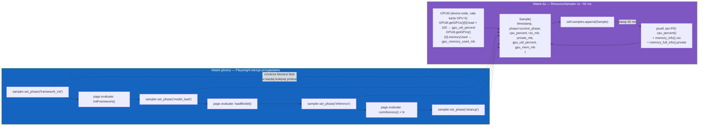

# Python profiler — przebieg z probkowaniem CPU / RAM / GPU

`e2e/benchmark_profiler.py` jest jedynym narzedziem mierzacym faktyczne
zuzycie zasobow systemowych (CPU%, RSS, GPU util%, GPU VRAM). Steruje
przegladarka przez Playwright dla Pythona i jednoczesnie probkuje w osobnym
watku tla co ~50 ms (`SAMPLE_INTERVAL_MS`):

- **CPU + RAM** — `psutil`, **suma per-process** po PID-ach Chromium
  (browser + renderer + GPU process + utility procesy itd.).
- **GPU util + VRAM** — `GPUtil` (wrapper na `nvidia-smi`), wartosci
  **device-wide** (calej karty graficznej, NIE filtrowane per-PID).
  Maszyna testowa powinna byc czysta — zadne inne aplikacje uzywajace GPU
  (Discord, gry, inne przegladarki), poniewaz ich zuzycie zlicza sie do
  pomiaru. W praktyce na czystym desktopie tlo to 0–2% i kilkaset MB
  VRAM (kompozytor Windows) — sygnal z inferencji jest znacznie wiekszy.

Uruchomienie:

```bash
npm run bench:profile -- --mode aggregate --task image
npm run bench:profile -- --mode session --task image --sessions 10
```

Wyniki: `benchmark_results/{benchmark|session}_results_{image|text}.{json,csv}`.

## Architektura: dwa watki, jedna oś czasu



## Pelny przeplyw — od argumentow CLI do CSV

```mermaid
flowchart TD
    Start([python benchmark_profiler.py]) --> ParseArgs[/Argparse:<br/>--mode aggregate/session<br/>--task image/text<br/>--sessions N=10/]
    ParseArgs --> Matrix[/Wybor MATRIX:<br/>IMAGE_MATRIX lub TEXT_MATRIX/]
    Matrix --> ComboLoop{"Petla po kombinacjach<br/>framework × backend"}

    ComboLoop -->|Nastepna kombinacja| Launch["chromium.launch<br/>custom build, CHROME_ARGS:<br/>--enable-precise-memory-info,<br/>--js-flags=--expose-gc,<br/>--enable-unsafe-webgpu,<br/>--enable-blink-features=TFLiteNativeInference,<br/>WebNN/WASM features"]
    Launch --> Pids["get_browser_pids():<br/>1. browser.new_browser_cdp_session<br/>   + SystemInfo.getProcessInfo<br/>2. fallback: psutil.process_iter<br/>   match chrome.exe/chromium.exe<br/>→ lista PIDow (browser, renderer, GPU, network)"]
    Pids --> NewSampler["ResourceSampler(pids)<br/>tworzy psutil.Process dla kazdego PIDu"]
    NewSampler --> Goto["page.goto localhost:5173<br/>czekaj az window.__benchmark != undefined"]
    Goto --> ModeBranch{Tryb?}

    %% ============== AGGREGATE ==============
    ModeBranch -->|aggregate| AG_Conf["page.evaluate:<br/>__benchmark.setTask + configure<br/>+ loadImage / setTextInput"]
    AG_Conf --> AG_StartSampler["sampler.start()<br/>(rusza watek tla)"]
    AG_StartSampler --> AG_F1["set_phase('framework_init')<br/>page.evaluate: createBenchmark<br/>+ initFramework(be) ⏱"]
    AG_F1 --> AG_Pre["page.evaluate: prefetchModel()<br/>(czas NIE mierzony)"]
    AG_Pre --> AG_F2["set_phase('model_load')<br/>page.evaluate: loadModel() ⏱"]
    AG_F2 --> AG_SetIn["page.evaluate: setInput<br/>(obraz lub tokenizacja tekstu)"]
    AG_SetIn --> AG_F3["set_phase('warmup')<br/>page.evaluate: WARMUP iter."]
    AG_F3 --> AG_F4["set_phase('inference')<br/>page.evaluate: ITERATIONS=30<br/>kazda iteracja ⏱"]
    AG_F4 --> AG_F5["set_phase('classification')<br/>page.evaluate: classify(5)"]
    AG_F5 --> AG_F6["set_phase('cleanup')<br/>page.evaluate: dispose()"]
    AG_F6 --> AG_Stop["sampler.stop()"]
    AG_Stop --> AG_Aggr["dla kazdej fazy:<br/>sampler.get_phase_metrics(name)<br/>→ filtruje samples po phase==name<br/>→ PhaseMetrics:<br/>  avg/peak CPU%, avg/peak GPU%,<br/>  RSS start/end/delta,<br/>  GPU VRAM start/end/delta,<br/>  sample_count"]
    AG_Aggr --> Close

    %% ============== SESSION ==============
    ModeBranch -->|session| SE_Conf["page.select_option dla<br/>#task, #framework, #backend, #mode<br/>page.fill #iterations, #warmup<br/>page.evaluate loadImage<br/>lub fill #text-input"]
    SE_Conf --> SE_StartSampler["sampler.start()<br/>set_phase('running')<br/>page.click('#run-btn')"]
    SE_StartSampler --> SE_Poll{"co 300 ms:<br/>licz wiersze<br/>#session-results-body"}
    SE_Poll -->|nowy wiersz #i| SE_Mark["set_phase('session_'+i)<br/>(etykieta obejmuje<br/>JEDNA inferencje;<br/>setup juz sie wykonal<br/>przed pierwszym wierszem)"]
    SE_Mark --> SE_Poll
    SE_Poll -->|N wierszy / btn aktywny| SE_Done["set_phase('done')<br/>sampler.stop()"]
    SE_Done --> SE_ReadSetup["page.evaluate: odczyt banera<br/>#session-setup-init / #session-setup-load<br/>→ JEDNORAZOWE setup_init_ms,<br/>setup_load_ms (te same dla<br/>calej kombinacji)"]
    SE_ReadSetup --> SE_Read["page.evaluate: odczyt komorek td<br/>z #session-results-body<br/>(tabela ma teraz 6 kolumn)<br/>→ inferenceMs, memMB, memDelta"]
    SE_Read --> SE_Join["dla iteracji i = 1..N:<br/>SessionResult(<br/>  framework_init_ms = setup_init_ms,<br/>  model_load_ms = setup_load_ms,<br/>  inference_ms ← z DOM,<br/>  total_ms = inference_ms<br/>  +<br/>  avg/peak CPU/GPU,<br/>  RSS start/end/delta,<br/>  GPU VRAM start/end/delta<br/>  ← sampler.get_phase_metrics('session_'+i)<br/>)"]
    SE_Join --> Close

    %% ============== COMMON END ==============
    Close["browser.close()"] --> ComboLoop

    ComboLoop -->|Macierz zakonczona| SaveJSON["json.dumps:<br/>benchmark_results_{image|text}.json<br/>lub session_results_{image|text}.json<br/>+ timestamp, task, mode, gpu_available"]
    SaveJSON --> SaveCSV["csv: jeden wiersz na sesje/kombinacje<br/>kolumny per fazowe:<br/>{phase}_avg_cpu, {phase}_peak_cpu,<br/>{phase}_avg_gpu, {phase}_peak_gpu,<br/>{phase}_mem_rss_start_mb,<br/>{phase}_mem_rss_end_mb,<br/>{phase}_mem_delta_mb,<br/>{phase}_gpu_mem_*_mb"]
    SaveCSV --> End([Koniec])

    style Start fill:#4CAF50,color:#fff
    style End fill:#4CAF50,color:#fff
    style ComboLoop fill:#FF9800,color:#fff
    style ModeBranch fill:#FF9800,color:#fff
    style SE_Poll fill:#FF9800,color:#fff
    style Launch fill:#1565C0,color:#fff
    style Pids fill:#7E57C2,color:#fff
    style NewSampler fill:#7E57C2,color:#fff
    style AG_StartSampler fill:#7E57C2,color:#fff
    style AG_Stop fill:#7E57C2,color:#fff
    style SE_StartSampler fill:#7E57C2,color:#fff
    style SE_Done fill:#7E57C2,color:#fff
    style SE_Mark fill:#7E57C2,color:#fff
    style SE_ReadSetup fill:#7E57C2,color:#fff
    style SE_Read fill:#7E57C2,color:#fff
    style AG_Aggr fill:#7E57C2,color:#fff
    style SE_Join fill:#7E57C2,color:#fff
    style AG_F1 fill:#1565C0,color:#fff
    style AG_F2 fill:#1565C0,color:#fff
    style AG_F4 fill:#1565C0,color:#fff
    style AG_F5 fill:#1565C0,color:#fff
    style AG_Pre fill:#78909C,color:#fff
    style AG_F3 fill:#9E9E9E,color:#fff
```



## Co dokladnie pojawia sie w jednej probce

```python
@dataclass
class Sample:
    timestamp: float
    phase: str                   # nazwa nadana przez sampler.set_phase(...)
    cpu_percent: float           # SUMA per-process p.cpu_percent() (moze przekroczyc 100% — multi-core)
    memory_rss_mb: float         # SUMA p.memory_info().rss / MB
    memory_private_mb: float     # SUMA p.memory_full_info().private / MB (Windows: working set)
    gpu_util_percent: float      # GPUtil.getGPUs()[0].load × 100 — device-wide, cala karta
    gpu_memory_used_mb: float    # GPUtil.getGPUs()[0].memoryUsed — device-wide, cala karta
```

CPU i pamiec to SUMA po PID-ach Chromium (browser proces + renderer + GPU
proces + utility procesy) — to robi `psutil`. GPU jest **device-wide** —
`GPUtil` wraca jedna liczbe utilization% i jedna liczbe VRAM dla calej
karty (`GPUtil.getGPUs()[0]`).

Dlaczego device-wide a nie per-PID:

- `nvmlDeviceGetProcessUtilization` na konsumenckich GeForce + WDDM zwraca
  `NVML_ERROR_NOT_FOUND` — API jest wspierane glownie na kartach Tesla.
- PDH `\GPU Engine(*)\Utilization Percentage` (zrodlo Task Managera) widzi
  WebGPU/WebGL przez Dawn/ANGLE, ale **nie widzi pracy DirectML** —
  WebNN i TFLite Native zwracaly 0% mimo realnej pracy GPU (potwierdzone
  przez wzrost VRAM w trakcie inferencji).
- Device-wide `nvidia-smi` lapie wszystko — pod warunkiem ze test biegnie
  na czystej maszynie.

## Z czego wynika "phase" w samplach

`sampler.set_phase(name)` zmienia atrybut `current_phase` w samplerze. Kolejne
probki (te ktore powstaja w petli watku tla) zostana otagowane nowa nazwa.
Dodatkowo `set_phase` od razu pobiera jedna probke, zeby krotka faza miala
gwarantowane co najmniej jeden punkt danych. `get_phase_metrics(name)` filtruje
liste `samples` po `phase == name` i agreguje statystyki.

## Tryby: aggregate vs session

| Cecha | `--mode aggregate` | `--mode session` |
|-------|--------------------|------------------|
| Sterowanie przegladarka | `page.evaluate` per faza | Klikanie UI (`select_option`, `fill`, `click`) + polling tabeli |
| Cykl zycia | jeden setup (init + load) → 30 inferencji | jeden setup (init + load) → N inferencji per-iteracja |
| Co mierzy wiersz | jedna kombinacja, agregaty avg/min/max/p95 | jedna inferencja w cieplym runtime |
| Granice faz w samplerze | `framework_init`, `model_load`, `warmup`, `inference`, `classification`, `cleanup` | `running` (przed pierwszym wierszem, obejmuje setup), nastepnie `session_1`, `session_2`, …, `session_N` (po jednej inferencji na etykiete) |
| `FrameworkInit(ms)` / `ModelLoad(ms)` | jednorazowe, pochodza z `performance.now()` w `page.evaluate` | jednorazowe, odczytywane z banera `#session-setup-info`; **ta sama wartosc na kazdym wierszu** danej kombinacji |
| Cel pomiaru | Steady-state inferencja, per-faza | Rozklad czasow inferencji iteracja po iteracji w cieplym runtime + jednorazowy koszt setupu |
| Output | `benchmark_results_{image\|text}.{json,csv}` | `session_results_{image\|text}.{json,csv}` |

> **Co odpowiada „cold-start" w trybie sesyjnym?** Pelny cold-start (init +
> load) wykonuje sie tylko raz, przed petla. Pierwsza inferencja (`session_1`)
> dziala juz na cieplym runtime, ale bez rozgrzanego JIT/cache inferencji,
> wiec zwykle bywa minimalnie wolniejsza niz iteracje 2..N. Zeby widziec
> faktyczny rozklad „pierwszy run vs kolejne", patrz na `Inference(ms)` per
> wiersz, a nie na `FrameworkInit(ms)` / `ModelLoad(ms)`.

## Lista wszystkich rejestrowanych metryk

Ten sam zestaw kolumn pojawia sie w obu trybach; tryb *aggregate* dodaje
statystyki rozkladu inferencji (avg/min/max/p95) i Top-1 predykcje, tryb
*session* ma jeden wiersz na iteracje inferencji.

### Czas (po stronie przegladarki, `performance.now()`)

| Kolumna | Jedn. | Faza | Co mierzy |
|---|---|---|---|
| `FrameworkInit(ms)` | ms | `framework_init` (aggregate) / setup banner (session) | `await initFramework(backend)` — rejestracja backendow, ladowanie modulow WASM, otwarcie WebGPU adaptera itp. **W trybie session wartosc jednorazowa, odczytywana z banera, ta sama na kazdym wierszu danej kombinacji.** |
| `ModelLoad(ms)` | ms | `model_load` (aggregate) / setup banner (session) | `await loadModel()` — bajty → skompilowana sesja/graf. **W trybie session jednorazowa, ta sama na kazdym wierszu.** |
| `Inference(ms)` (session) | ms | `session_i` | Pojedyncze `runInference()` w iteracji `i`. |
| `Total(ms)` (session) | ms | — | Rowny `Inference(ms)` (setup wykonal sie raz przed petla, NIE jest doliczany do kazdego wiersza). |
| `AvgInference(ms)` (aggregate) | ms | `inference` | Srednia z `ITERATIONS=30` inferencji. |
| `MinInference(ms)` / `MaxInference(ms)` (aggregate) | ms | `inference` | Skrajne czasy. |
| `P95Inference(ms)` (aggregate) | ms | `inference` | 95-ty percentyl — odporny na pojedyncze artefakty GC/JIT. |

`prefetchModel()` (download bajtow modelu) jest wykonywane miedzy
`framework_init` a `model_load`, ale **nie jest mierzone** — czas zalezy od
cache HTTP / sieci, nie od frameworka.

### CPU (psutil, sumowane po PID-ach Chromium)

| Kolumna | Jedn. | Source | Co mierzy |
|---|---|---|---|
| `Init_AvgCPU(%)` | % | psutil `cpu_percent()` | Srednia CPU% w fazie `framework_init`, suma po wszystkich PID-ach Chromium. Moze przekroczyc 100% (multi-core: 200% = 2 rdzenie pelne). |
| `Init_PeakCPU(%)` | % | jw. | Maksymalna probka w fazie. |
| `Load_AvgCPU(%)` / `Load_PeakCPU(%)` | % | jw. | Faza `model_load` (kompilacja). |
| `Inf_AvgCPU(%)` / `Inf_PeakCPU(%)` | % | jw. | Faza `inference` — najwazniejszy wskaznik dla backendow WASM. |

### RAM procesu rendera (psutil RSS, sumowane po PID-ach Chromium)

| Kolumna | Jedn. | Source | Co mierzy |
|---|---|---|---|
| `Load_MemRSS_Start(MB)` | MB | psutil `memory_info().rss` | RSS na poczatku fazy `model_load`. |
| `Load_MemRSS_End(MB)` | MB | jw. | RSS na koncu fazy `model_load`. |
| `Load_MemDelta(MB)` | MB | end - start | Pamiec przybyła w wyniku kompilacji modelu (skompilowany graf, bufory wag). |
| `Inf_MemRSS_Start(MB)` | MB | jw. | RSS na poczatku fazy `inference`. |
| `Inf_MemRSS_End(MB)` | MB | jw. | RSS na koncu fazy `inference`. |
| `Inf_MemDelta(MB)` | MB | end - start | Wzrost pamieci przez sama inferencje (bufory aktywacji, ewentualne wycieki). |

`memory_private_mb` (`memory_full_info().private`, Windows working set) jest
zapisywane w surowych samplach (i w JSON), ale nie trafia do CSV — heurystycznie
zwykle bardzo blisko RSS.

### GPU (device-wide, cala karta — GPUtil/nvidia-smi)

| Kolumna | Jedn. | Source | Co mierzy |
|---|---|---|---|
| `Init_AvgGPU(%)` / `Init_PeakGPU(%)` | % | `GPUtil.getGPUs()[0].load × 100` | Wykorzystanie GPU (cala karta) w fazie `framework_init`. Zawiera wszystko co dzieje sie na GPU — w tym ewentualne tlo systemu. |
| `Load_*` GPU | — | — | (Brak GPU% dla `model_load` w CSV — kompilacja zwykle nie obciaza GPU znaczaco.) |
| `Inf_AvgGPU(%)` / `Inf_PeakGPU(%)` | % | jw. | Najwazniejszy wskaznik dla backendow GPU (WebGL / WebGPU / WebNN / TFLite Native GPU). |
| `Inf_GPU_Mem_Start(MB)` | MB | `GPUtil.getGPUs()[0].memoryUsed` | VRAM zaalokowana na karcie na poczatku fazy `inference` (wartosc bezwzgledna, cala karta). |
| `Inf_GPU_Mem_End(MB)` | MB | jw. | VRAM na koncu fazy. |
| `Inf_GPU_Mem_Delta(MB)` | MB | end - start | Przyrost VRAM w czasie inferencji — sluzy do oszacowania ile pamieci sama inferencja zaalokowala (kompozytor i procesy systemowe nie zmieniaja swojego zuzycia, wiec delta jest "czysta"). |

Wartosc `gpu_util_percent` jest device-wide z `nvidia-smi`. To jest
"sredni czas zajetosci silnikow GPU w okresie samplowania" — w praktyce
to samo co kolumna GPU w `nvidia-smi`. Lapie kazda prace GPU (D3D11, D3D12,
DirectML, OpenGL, CUDA) — w przeciwienstwie do per-PID PDH, ktory pomijal
DirectML.

### Tylko aggregate — predykcje

| Kolumna | Jedn. | Source | Co mierzy |
|---|---|---|---|
| `Top1Prediction` | string | `await classify(5)` | Najwyzej oceniana klasa / sentyment. Sluzy do walidacji ze backend nie zwraca smieci. |
| `Top1Score(%)` | % | jw. | Pewnosc top-1. |

### Meta

| Kolumna | Co opisuje |
|---|---|
| `Task` | `image-classification` lub `text-classification` |
| `Framework` | `tfjs` / `onnx` / `litert` / `transformersjs` / `tflite-native` |
| `Backend` | `wasm-simd-threads` / `webgl` / `webgpu` / `webnn` / `cpu` / `gpu` |
| `Session#` (session mode) | Numer iteracji inferencji 1..N. Po refaktorze setup wykonuje sie **raz** przed petla, wiec wszystkie iteracje mierza inferencje na cieplym runtime. Roznica miedzy iteracja 1 a 2..N to glownie rozgrzewka JIT/cache inferencji, NIE cold-start frameworka. |
| `Error` | Pusty przy sukcesie; przy bledzie zawiera komunikat (np. "WebNN not supported"). |

### Co jest w JSON ale nie w CSV

JSON dump (`{benchmark|session}_results_*.json`) zawiera dodatkowo:

- `phases[*].sample_count` — ile probek 50 ms zlapano w danej fazie
  (waliduje czy faza nie byla zbyt krotka by ja sensownie zmierzyc).
- `phases[*].wall_time_ms` — wall-clock czas fazy mierzony przez sampler
  (`timestamp ostatniej probki - timestamp pierwszej`). Powinien byc bliski
  sumie odpowiednikow z `performance.now()`.
- `predictions[]` (aggregate) — pelne top-5 predykcji z `score`.
- `gpu_available` — bool czy NVML udalo sie zainicjowac.
- W `Sample` (raw) jest tez `memory_private_mb` i sciezka czasowa kazdej probki.

## Legenda

| Kolor | Znaczenie |
|-------|-----------|
| Zielony | Start / koniec |
| Niebieski (jasny) | Wykonanie kodu w przegladarce — fazy mierzone `performance.now()` |
| Fioletowy | Operacje samplera CPU/GPU/RAM (Python, watek tla) |
| Pomaranczowy | Petle / decyzje |
| Szary ciemny | Fazy bez pomiaru czasu (np. pobranie modelu) |
| Szary jasny | Rozgrzewka (wyniki odrzucone) |

## Wymagania i ograniczenia GPUtil / nvidia-smi

- **Tylko NVIDIA GPU.** `GPUtil` parsuje wyjscie `nvidia-smi`. Dla Intel/AMD potrzebne byloby cos innego (`intel_gpu_top`, `radeontop`, DXGI counters).
- **Device-wide, nie per-PID.** Wszystko co dzieje sie na karcie wlicza sie do pomiaru. Maszyna testowa musi byc czysta — zamknij Discord, gry, inne przegladarki, OBS itd. przed uruchomieniem benchmarku.
- **Sampling `nvidia-smi` jest wewnetrznie ~100 ms–1 s** — bardzo krotkie burst-y GPU mozna przeoczyc. W praktyce wystarczajace dla 30 iteracji w trybie aggregate.
- **WDDM na Windows** czasem raportuje mniej VRAM niz faktycznie zaalokowane (pamiec moze byc paged przez OS). Wartosci sa zwykle blisko prawdy.

## Co NIE jest mierzone

- **Per-PID GPU** — sprobowano `pynvml` + Windows PDH; oba nie dzialaly poprawnie dla DirectML (WebNN, TFLite Native GPU) na konsumenckich GeForce, dlatego zostalo device-wide.
- Inne procesy uzywajace GPU SA wliczane (poniewaz device-wide). Sprzatnij maszyne testowa.
- Bezczynne procesy Chromium (utility processes) sa wliczane do CPU/RAM. Realna inferencja zwykle dominuje sygnal.
- Brak instrumentacji per-WebGPU-command — nie wiemy "ile czasu spedzil shader X". Tylko sumaryczne GPU util%.
