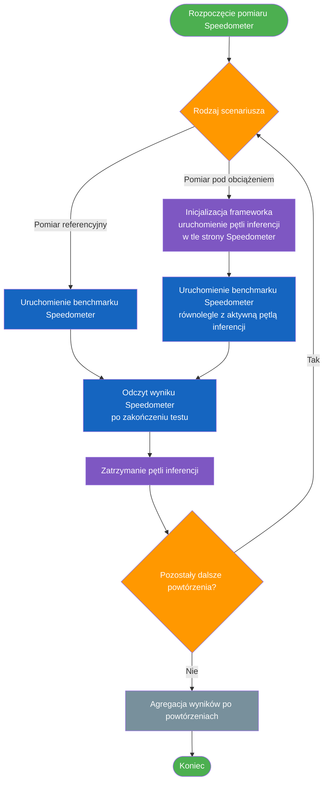

# Speedometer pod obciazeniem inferencji — przebieg

`e2e/speedometer_under_load.py` mierzy wynik benchmarku Speedometer 4
w Chromium, rownoczesnie utrzymujac w tej samej stronie ciagla petle
inferencji wybranego frameworka. Daje to liczbowa odpowiedz na pytanie
"o ile pogarsza sie responsywnosc aplikacji webowej, gdy w tle leci
modelek MobileNet/DistilBERT na backendzie X". Domyslnie kazdy przebieg
zawiera tez baseline bez inferencji, zeby wynik pod obciazeniem mial
referencje zmierzona na tej samej maszynie.

Architektura roznia sie od pozostalych skryptow w `e2e/`:

| Cecha | `benchmark_profiler.py` | `speedometer_under_load.py` |
|---|---|---|
| Liczba zakladek | 1 | 1 |
| Strona testowa | `localhost:5173` (UI benchmarku) | `localhost:5173/speedometer/` |
| Skad bierze sie kod inferencji | `window.__benchmark.run()` w UI | `page.evaluate()` injektuje petle do strony Speedometra |
| Wspoldzielenie procesu | inferencja i UI w tym samym renderze | inferencja i Speedometer w tym samym renderze |
| Co mierzymy | czasy faz + CPU/GPU/RAM | wynik Speedometra + ile inferencji wykonano |

Kluczowy punkt: Speedometer i adaptery z `src/benchmarks/` zyja na tym
samym originie (Vite serwuje `vendor/Speedometer/` pod `/speedometer/`
przez plugin `serveSpeedometer()` w `vite.config.ts`), wiec injektowany
skrypt moze zrobic `await import('/src/benchmarks/index.ts')` bez CORS
i bez utraty `crossOriginIsolated` (dzieki czemu wieloglowicowy WASM
nadal dziala).

Uruchomienie:

```bash
npm run dev                                                        # Vite na :5173
python e2e/speedometer_under_load.py                               # baseline + onnx:wasm-simd-threads, image
python e2e/speedometer_under_load.py --combos onnx:webgpu,tfjs:webgpu
python e2e/speedometer_under_load.py --all                          # cala IMAGE_MATRIX (14 kombinacji)
python e2e/speedometer_under_load.py --all --task text              # cala TEXT_MATRIX (14 kombinacji)
python e2e/speedometer_under_load.py --all --no-baseline
python e2e/speedometer_under_load.py --all --repeats 5              # 5 powtorzen na kombinacje + agregaty
```

Wyniki (sufiks `<task>` to `image` lub `text` — pliki dla obu zadan
istnieja obok siebie i nie nadpisuja sie wzajemnie):
- `benchmark_results/speedometer_under_load_<task>.csv` — jeden wiersz na **kazdy
  pojedynczy bieg** (z kolumna `Repeat`).
- `benchmark_results/speedometer_under_load_summary_<task>.csv` — jeden wiersz
  na unikalna kombinacje (scenario, framework, backend, task) z
  agregatami `avg/min/max/p95/stdev` po wszystkich powtorzeniach.
- `benchmark_results/speedometer_under_load_<task>.json` — `{"runs": [...],
  "summary": [...]}` zawierajacy oba widoki.

Wszystko jest nadpisywane po **kazdym pojedynczym biegu** (incremental
save), wiec crash w polowie macierzy / w polowie powtorzen nie kasuje
wczesniejszych wynikow.

## Widok wysokopoziomowy

Diagram pomija szczegóły techniczne (nazwy funkcji, parametry interfejsu
linii poleceń, selektory DOM) i przedstawia **logikę pomiaru oraz źródła
zbieranych metryk**. Pełna specyfikacja techniczna znajduje się poniżej
w sekcji „Pełny przepływ”.



Istota pomiaru: porównywany jest **wynik Speedometra uzyskany w warunkach
referencyjnych** (bez dodatkowego obciążenia przeglądarki) z **wynikiem
Speedometra uzyskanym przy jednoczesnym wykonywaniu pętli wnioskowania
w tej samej karcie**. Różnica procentowa między tymi pomiarami stanowi
miarę degradacji responsywności aplikacji webowej wynikającej z użycia
danej kombinacji frameworka i backendu inferencyjnego.

## Pelny przeplyw

```mermaid
flowchart TD
    Start([python speedometer_under_load.py]) --> ParseArgs[/Argparse:<br/>--combos / --all<br/>--task image/text<br/>--no-baseline<br/>--speedometer-timeout=600/]
    ParseArgs --> SelectMatrix{"Tryb wyboru kombinacji"}
    SelectMatrix -->|--all| FullMatrix[/IMAGE_MATRIX 14<br/>lub TEXT_MATRIX 14/]
    SelectMatrix -->|--combos fw1:be1,fw2:be2| Custom[/Wlasna lista/]
    SelectMatrix -->|brak flag| Default[/onnx:wasm-simd-threads/]
    FullMatrix --> Scenarios
    Custom --> Scenarios
    Default --> Scenarios

    Scenarios{"Lista scenariuszy:<br/>baseline opcjonalny<br/>+ kombinacje fw × be"}

    Scenarios -->|Nastepny scenariusz| Launch["chromium.launch<br/>custom build,<br/>CHROME_ARGS:<br/>--enable-precise-memory-info,<br/>--js-flags=--expose-gc,<br/>--enable-unsafe-webgpu,<br/>--enable-blink-features=TFLiteNativeInference,<br/>WebNN* + WASM features"]
    Launch --> Context["context = browser.new_context<br/>viewport 1280×900<br/>(Speedometer wymaga sensownego<br/>rozmiaru okna do wynikow)"]
    Context --> Page["page = context.new_page<br/>set_default_timeout = speedometer_timeout × 1000"]
    Page --> Goto["page.goto<br/>http://localhost:5173/speedometer/<br/>(Vite plugin serveSpeedometer<br/>serwuje vendor/Speedometer/<br/>z naglowkami COOP/COEP)"]
    Goto --> WaitBtn["page.wait_for_selector<br/>'.start-tests-button' visible<br/>timeout 30 s<br/>(potwierdza ze main.mjs Speedometra wystartowal)"]

    WaitBtn --> ScenarioBranch{Scenariusz?}

    %% ============== BASELINE ==============
    ScenarioBranch -->|baseline| BL_Click["page.click '.start-tests-button'"]

    %% ============== UNDER LOAD ==============
    ScenarioBranch -->|under_load| UL_Boot["page.evaluate INFERENCE_BOOT_JS<br/>w stronie Speedometra:<br/>1. await import '/src/benchmarks/index.ts'<br/>2. createBenchmark(fw, task)<br/>3. await initFramework(be)<br/>4. await prefetchModel()<br/>5. await loadModel()<br/>6. await preprocessImage('/rocky.jpg')<br/>   lub getTokenizer().tokenize(TEXT_INPUT)<br/>7. setInput(input)<br/>8. start petli (IIFE) z await setTimeout(0)<br/>   po kazdej iteracji ⚠"]
    UL_Boot --> UL_Sleep["time.sleep 1.5 s<br/>(daj petli czas zlapac kilka iteracji)"]
    UL_Sleep --> UL_Status["page.evaluate INFERENCE_STATUS_JS<br/>→ {running, count, elapsedMs, error}"]
    UL_Status --> UL_StatusCheck{running == true?}
    UL_StatusCheck -->|Nie| Err["RuntimeError:<br/>'Inference loop is not running'"]
    UL_StatusCheck -->|Tak| UL_Click["page.click '.start-tests-button'"]

    BL_Click --> WaitScore
    UL_Click --> WaitScore

    %% --- Wspolny: czekamy na wynik Speedometra ---
    WaitScore["page.wait_for_function:<br/>SPEEDOMETER_SCORE_PREDICATE<br/>czyta #result-number tekst,<br/>parsuje regexem /-?\\d+(?:\\.\\d+)?/<br/>blokuje az element ma liczbe<br/>timeout speedometer_timeout (default 600 s)"]
    WaitScore --> ReadScore["page.evaluate SPEEDOMETER_SCORE_PREDICATE<br/>→ float(score)"]
    ReadScore --> StopBranch{Scenariusz?}

    StopBranch -->|baseline| Save
    StopBranch -->|under_load| UL_Stop["page.evaluate INFERENCE_STOP_JS:<br/>1. state.running = false<br/>2. await state.loop (czeka na biezaca iteracje)<br/>3. elapsedMs = performance.now - startTime<br/>4. await benchmark.dispose()<br/>5. delete window.__inferenceLoad<br/>→ {count, elapsedMs, error}"]

    UL_Stop --> Save["SpeedometerRow:<br/>timestamp, scenario, framework, backend, task,<br/>speedometer_score,<br/>inferences_completed, inference_loop_seconds,<br/>inference_error, error"]
    Save --> Close["browser.close"]
    Close --> SaveAll["save_results(rows) — incremental:<br/>JSON + CSV nadpisywane po KAZDYM scenariuszu<br/>→ crash przy kombinacji N nie kasuje 0..N-1"]
    SaveAll --> Scenarios

    Scenarios -->|Lista wyczerpana| Summary["Tabela podsumowujaca:<br/>scenariusz | fw | be | score | infers | loop_s | Δ vs baseline"]
    Summary --> End([Koniec])

    Err --> Close

    style Start fill:#4CAF50,color:#fff
    style End fill:#4CAF50,color:#fff
    style Scenarios fill:#FF9800,color:#fff
    style ScenarioBranch fill:#FF9800,color:#fff
    style StopBranch fill:#FF9800,color:#fff
    style SelectMatrix fill:#FF9800,color:#fff
    style UL_StatusCheck fill:#FF9800,color:#fff
    style Launch fill:#1565C0,color:#fff
    style Goto fill:#1565C0,color:#fff
    style WaitBtn fill:#1565C0,color:#fff
    style WaitScore fill:#1565C0,color:#fff
    style ReadScore fill:#1565C0,color:#fff
    style BL_Click fill:#1565C0,color:#fff
    style UL_Click fill:#1565C0,color:#fff
    style UL_Boot fill:#7E57C2,color:#fff
    style UL_Status fill:#7E57C2,color:#fff
    style UL_Stop fill:#7E57C2,color:#fff
    style UL_Sleep fill:#9E9E9E,color:#fff
    style Save fill:#78909C,color:#fff
    style SaveAll fill:#78909C,color:#fff
    style Err fill:#D32F2F,color:#fff
```



## Co dokladnie injektujemy do strony Speedometra

Trzy bloki JS sa zdefiniowane jako stringi w `speedometer_under_load.py`
i wykonywane przez `page.evaluate(...)` w kontekscie strony Speedometra:

### `INFERENCE_BOOT_JS` — startuje petle
```js
async ([fwId, beId, taskId, imageUrl, textInput]) => {
    const { createBenchmark } = await import('/src/benchmarks/index.ts');
    const benchmark = createBenchmark(fwId, taskId);
    await benchmark.initFramework(beId);
    await benchmark.prefetchModel();
    await benchmark.loadModel();

    let input;
    if (taskId === 'image-classification') {
        const { preprocessImage } = await import('/src/utils/image-input.ts');
        input = { type: 'image', image: await preprocessImage(imageUrl) };
    } else {
        const { getTokenizer } = await import('/src/utils/tokenizer.ts');
        const tokenizer = await getTokenizer();
        input = { type: 'text', text: tokenizer.tokenize(textInput), rawText: textInput };
    }
    benchmark.setInput(input);

    const state = { benchmark, running: true, count: 0,
                    startTime: performance.now(), error: null, loop: null };
    state.loop = (async () => {
        while (state.running) {
            try {
                await benchmark.runInference();
                state.count++;
                await new Promise(r => setTimeout(r, 0));   // ⚠ kluczowe
            } catch (err) {
                state.error = err?.message ?? String(err);
                state.running = false;
                break;
            }
        }
    })();
    window.__inferenceLoad = state;
}
```

`await new Promise(r => setTimeout(r, 0))` po kazdej iteracji jest
**kluczowy**. Inferencja na WASM resolwuje sie czesto synchronicznie —
bez tego yieldu petla `while + await` zostaje tylko w kolejce mikrotaskow
i nigdy nie oddaje sterowania kolejce makrotaskow. To by:
- zablokowalo UI Speedometra (frame-render to makrotask),
- zablokowalo komunikaty CDP (przez ktore Playwright odbiera odpowiedzi `evaluate`),
- spowodowalo zawieszenie skryptu sterujacego.

`setTimeout(0)` wstawia jeden makrotask, ktory wymusza drenazu kolejki
mikrotaskow i odpalenie kolejnej tury makrotaskow (rendering, CDP,
pozostaly setup Speedometra) przed kolejna inferencja.

### `INFERENCE_STATUS_JS` — sprawdza ze petla zyje
```js
() => {
    const s = window.__inferenceLoad;
    if (!s) return { running: false, count: 0, elapsedMs: 0, error: null };
    return {
        running: s.running,
        count: s.count,
        elapsedMs: performance.now() - s.startTime,
        error: s.error,
    };
}
```

Wywolywane raz po 1.5 s od bootowania, przed klikiem Start. Jesli
`running == false` to znaczy ze inferencja sie wywalila przed startem
Speedometra (np. brakujace WASM, niewspierany backend) — wtedy skrypt
podnosi `RuntimeError` i zamyka przegladarke zamiast generowac smieciowy
wynik.

### `INFERENCE_STOP_JS` — zatrzymuje + sprzata
```js
async () => {
    const s = window.__inferenceLoad;
    if (!s) return { count: 0, elapsedMs: 0, error: null };
    s.running = false;
    await s.loop;                            // dokoncz biezaca iteracje
    const elapsedMs = performance.now() - s.startTime;
    try { await s.benchmark.dispose(); } catch (e) {}
    delete window.__inferenceLoad;
    return { count: s.count, elapsedMs, error: s.error };
}
```

`count` jest dokladna miara "ile inferencji udalo sie wykonac w czasie
trwania Speedometra". `elapsedMs` to czas od `startContinuous` do `stop`,
czyli od konca ladowania modelu do konca testu Speedometra (NIE samego
testu Speedometra).

## Top-level vs iframe — gdzie zyje petla inferencji

`page.evaluate()` bez argumentu frame'a leci w glownej ramce strony, wiec
`window.__inferenceLoad` siedzi na **top-levelu Speedometra** (na stronie
z `.start-tests-button` i `#result-number`) — nigdy w iframe'ach,
w ktorych Speedometer faktycznie odpala kazdy workload (TodoMVC w React,
Vue, Svelte itd.).

**Co jest takie samo niezaleznie od miejsca injekcji**: iframe'y testow
sa serwowane z `vendor/Speedometer/resources/...`, czyli **z tego samego
originu** co rodzic. Domyslna site-isolation Chromium dla same-origin
iframe'ow trzyma je **w tym samym procesie rendera I na tym samym watku
glownym** co rodzic. Wiec petla na top-levelu konkuruje o dokladnie ten
sam watek, ktory iframe uzywa do renderowania i mierzenia reakcji
TodoMVC. Kontencja dosiega mierzonej pracy w obu wariantach.

**Dlaczego nie injektujemy do iframe'a** (w kolejnosci waznosci):

1. **Cykl zycia iframe'a** — to jest realny powod. Speedometer **niszczy
   i tworzy nowy iframe** miedzy workloadami (czasem miedzy iteracjami
   tego samego workloadu). Petla wewnatrz iframe'a umarlaby razem z nim:
   zaladowany model + skompilowany graf + WASM heap znikalyby co kilka
   sekund. Trzeba by re-injektowac 20+ razy w trakcie jednego biegu
   Speedometra, a Playwright nie ma czystego hooka "injektuj zaraz po
   stworzeniu iframe'a, ale zanim Speedometer zacznie mierzyc". Z
   top-levelu petla przezywa caly bieg w stanie wpolnoty.

2. **Priorytet kolejki taskow per-frame** — scheduler Chromium moze
   priorytetyzowac taski widocznej / mierzonej ramki nad tlowymi
   timerami innych ramek. Taski kolejkowane przez `setTimeout(0)`
   z rodzica moga byc nieznacznie opoznione za `requestAnimationFrame`
   iframe'a, na ktorym opiera sie pomiar Speedometra. Petla wewnatrz
   iframe'a interferowalaby troche bardziej bezposrednio. W praktyce
   roznica jest mala wzgledem samej kontencji.

3. **Ksiegowanie heapu** — kazda ramka ma swoj realm JS, wiec wagi
   modelu i bufory tensorow lecza sie do heapu rodzica, nie iframe'a.
   Speedometer nie mierzy heapu wiec to nie wplywa na wynik, ale
   warto wiedziec gdyby kiedys do skryptu doszedl
   `performance.measureUserAgentSpecificMemory()`.

4. **Realizm scenariusza** — to co modelujesz ("inferencja leci kiedy
   user uzywa mojej aplikacji webowej") wyglada jak top-level + top-level,
   nie jak iframe + iframe-siostra. Top-level injection lepiej oddaje
   realny przypadek.

**Wniosek**: zostaw petle gdzie jest. Gdyby kiedys byc potrzebna
injekcja per-iframe, wymaga: hooka `page.on('frameattached')`, wywolania
`frame.evaluate()` w srodku, mechanizmu szybkiego re-bootowania petli —
nie warta swojej zlozonosci wzgledem znikomej roznicy w pomiarze.

## Skad bierze sie wynik Speedometra

```js
// SPEEDOMETER_SCORE_PREDICATE
() => {
    const el = document.getElementById('result-number');
    if (!el) return null;
    const text = (el.textContent || '').trim();
    const m = text.match(/-?\d+(?:\.\d+)?/);
    return m ? parseFloat(m[0]) : null;
}
```

Speedometer 4 po zakonczeniu wszystkich iteracji wpisuje liczbe (geomean
ze srednich powtorzen, patrz `vendor/Speedometer/README.md`) do
`#result-number`. Skrypt czeka az ten element ma w sobie cyfry, parsuje
regexem i zwraca jako float. Ten sam selektor dziala w Speedometer 3
i 4 — gdyby kiedys Speedometer zmienil markup wyniku, zmiana jest
ograniczona do tej jednej funkcji.

## Wynikowy wiersz CSV

`benchmark_results/speedometer_under_load_<task>.csv` (osobne pliki dla
`image` i `text`):

| Kolumna | Typ | Co opisuje |
|---|---|---|
| `Timestamp` | ISO8601 | Czas startu scenariusza (lokalny). |
| `Scenario` | enum | `baseline` (Speedometer bez inferencji) lub `under_load` (Speedometer + petla). |
| `Framework` | string | `tfjs` / `onnx` / `litert` / `transformersjs` / `tflite-native`. Pusty dla baseline. |
| `Backend` | string | `wasm-simd-threads` / `webgl` / `webgpu` / `webnn` / `cpu` / `gpu`. Pusty dla baseline. |
| `Task` | string | `image` lub `text` — z argumentu `--task`. |
| `SpeedometerScore` | float | Wynik Speedometra (geomean wszystkich workloadow). Pusty jesli scrape sie wywalil. |
| `Repeat` | int | Numer powtorzenia w obrebie kombinacji (1..N, gdzie N = `--repeats`). Przy `--repeats 1` zawsze 1. |
| `InferencesCompleted` | int | Ile petli `runInference()` przelecialo od startu petli do `stop`. 0 dla baseline. |
| `InferenceLoopSeconds` | float | Czas zycia petli w sekundach. 0 dla baseline. |
| `Throughput(inf/s)` | float | `InferencesCompleted / InferenceLoopSeconds` — przepustowosc inferencji **pod obciazeniem Speedometra**. Puste dla baseline. Por. z `1000 / AvgInference(ms)` z `benchmark_profiler.py` (przepustowosc bez kontencji), zeby zobaczyc o ile spowolnila sama inferencja. |
| `SpeedometerDeltaPct` | float | Procentowa zmiana `SpeedometerScore` wzgledem wiersza `baseline` (`(score - baseline) / baseline * 100`). Ujemna wartosc = backend spowolnil Speedometra. Puste dla baseline lub jesli baseline nie zostal wykonany. |
| `InferenceError` | string | Komunikat z `state.error` jesli petla sie wywalila w trakcie. |
| `Error` | string | Komunikat z poziomu Pythona — np. timeout Speedometra, brak strony, RuntimeError ze sanity-checku. |

### Plik agregatow `speedometer_under_load_summary_<task>.csv`

Generowany przy kazdym `save_results()` z bezposredniej grupizacji
wierszy szczegolowych. Jeden wiersz na unikalna kombinacje
`(scenario, framework, backend, task)`.

| Kolumna | Opis |
|---|---|
| `Scenario`, `Framework`, `Backend`, `Task` | Klucz grupy. |
| `Attempts` | Liczba prob (= `--repeats`). |
| `Successful` | Ile prob zakonczylo sie z poprawnym `SpeedometerScore` (reszta to bledy / timeouty). |
| `Score_Avg` / `Score_Min` / `Score_Max` / `Score_P95` / `Score_Stdev` | Statystyki po `SpeedometerScore` z udanych prob. P95 wyznaczany jak w `benchmark_profiler.py` — `int(N * 0.95) - 1` po posortowanej liscie. Dla N=1..2 P95 ≈ Max. Stdev to **proba** (n-1). |
| `Throughput_Avg` / `Min` / `Max` / `P95` | Jak wyzej, ale po `Throughput(inf/s)`. |
| `Inferences_Avg` / `Min` / `Max` | Liczba inferencji wykonanych podczas Speedometra — usrednione. |
| `SpeedometerDeltaPct_Avg` | Procentowa zmiana `Score_Avg` wzgledem **sredniego baseline** (`(Score_Avg − BaselineScore_Avg) / BaselineScore_Avg × 100`). Puste dla baseline lub jesli baseline nie zostal wykonany. |

Per-row `SpeedometerDeltaPct` w pliku `speedometer_under_load_<task>.csv` tez
uzywa **sredniego baseline** jako odniesienia (nie pierwszego biegu) —
zeby pojedynczy outlier w baseline nie zepsul wszystkich delt.

## Jak interpretowac wyniki

- **Niski Δ (np. -2%)** — backend praktycznie nie konkuruje z watkiem
  glownym Speedometra (typowo WebGPU / WebNN — praca leci na GPU,
  glowny watek tylko czeka na fence).
- **Duzy Δ (np. -40%)** — backend obciaza CPU watku glownego (typowo
  WASM SIMD threads — caly model leci na CPU). Speedometer ma duzo
  pracy w main thread, wiec scheduler musi sie dzielic czasem.
- **InferencesCompleted bardzo male przy duzym Δ** — petla zostala
  zaglodzona przez Speedometra (np. `tflite-native cpu` na slabszej
  maszynie). Wynik Δ nadal jest wazny, ale "tlo" jest w praktyce
  cienkie.
- **InferencesCompleted bardzo duze przy malym Δ** — backend jest
  niezalezny od Speedometra (typowo GPU): petla leci 100% predkosci,
  Speedometer tez leci 100% predkosci, kontencja jest minimalna.

## Co NIE jest mierzone

- **CPU/GPU/RAM** — w odroznieniu od `benchmark_profiler.py` nie ma
  tutaj samplera psutil/GPUtil. Jesli potrzebujesz wykres `nvidia-smi`
  w trakcie Speedometra, dodaj `ResourceSampler` analogiczny do tego
  z `benchmark_profiler.py` (PID-y mozna wyciagnac przez
  `browser.new_browser_cdp_session().send('SystemInfo.getProcessInfo')`).
- **Per-iteracja czasy inferencji** — petla nie zapisuje histogramu
  czasow `runInference()`, tylko sumaryczny licznik. Jesli chcesz
  rozklad, modyfikuj `INFERENCE_BOOT_JS` zeby pushowal do tablicy.
- **Per-workload Speedometra** — czytamy tylko geomean (`#result-number`).
  Speedometer wystawia tez surowe czasy per-test w developer-mode
  (`vendor/Speedometer/resources/developer-mode.mjs`), ale skrypt ich
  nie czyta.
- **Cache HTTP modelu** — pierwsza kombinacja w macierzy ma cold-cache
  (sciaga model z `localhost`), kolejne moga miec hit. Wplyw jest
  pomijalny (sam czas downloadu nie liczy sie do `SpeedometerScore`),
  ale jesli porownujesz framework_init/model_load — pamietaj.

## Wymagania srodowiskowe

- `vendor/Speedometer/` musi istniec i miec `index.html` + `resources/`
  (`git clone --depth 1 https://github.com/WebKit/Speedometer.git vendor/Speedometer`).
  Bez tego Vite zwroci 404 i `wait_for_selector('.start-tests-button')`
  rzuci timeout.
- `npm run dev` musi byc uruchomione przed skryptem (port 5173).
- Custom Chromium (`D:\chr-build\chromium\src\out\Release\chrome.exe`)
  potrzebny dla WebNN i TFLite Native — bez niego te backendy w macierzy
  zwroca error w kolumnie `Error`.
- Speedometer 4 wymaga viewportu >= 850×650; skrypt ustawia 1280×900.

## Znane ograniczenia per-kombinacja

Macierze `IMAGE_MATRIX` / `TEXT_MATRIX` w tym pliku sa zsynchronizowane
z `e2e/benchmark_profiler.py`. Pelny opis ograniczen kombinacji (m.in. ze
`litert:webgpu` w trybie `text` kompiluje sie z bledem przez luki
operatorowe `GATHER`/`STRIDED_SLICE` w `@litertjs/core` v2.0) znajduje
sie w [`python-profiler-flow.md`](python-profiler-flow.md#znane-ograniczenia-per-kombinacja).
Te same kombinacje zachowuja sie tutaj tak samo — failujace kombinacje
trafiaja do CSV jako wiersz z `inferences_completed=0` i komunikatem
w polu `inference_error`.

## Legenda

| Kolor | Znaczenie |
|---|---|
| Zielony | Start / koniec |
| Niebieski | Operacje Playwrighta na stronie (goto, click, wait_for_selector, wait_for_function) |
| Fioletowy | `page.evaluate` z injektowanym JS — boot/status/stop petli inferencji |
| Pomaranczowy | Decyzje / petle |
| Szary | Sleep / save / setup |
| Czerwony | Sciezka bledu |
